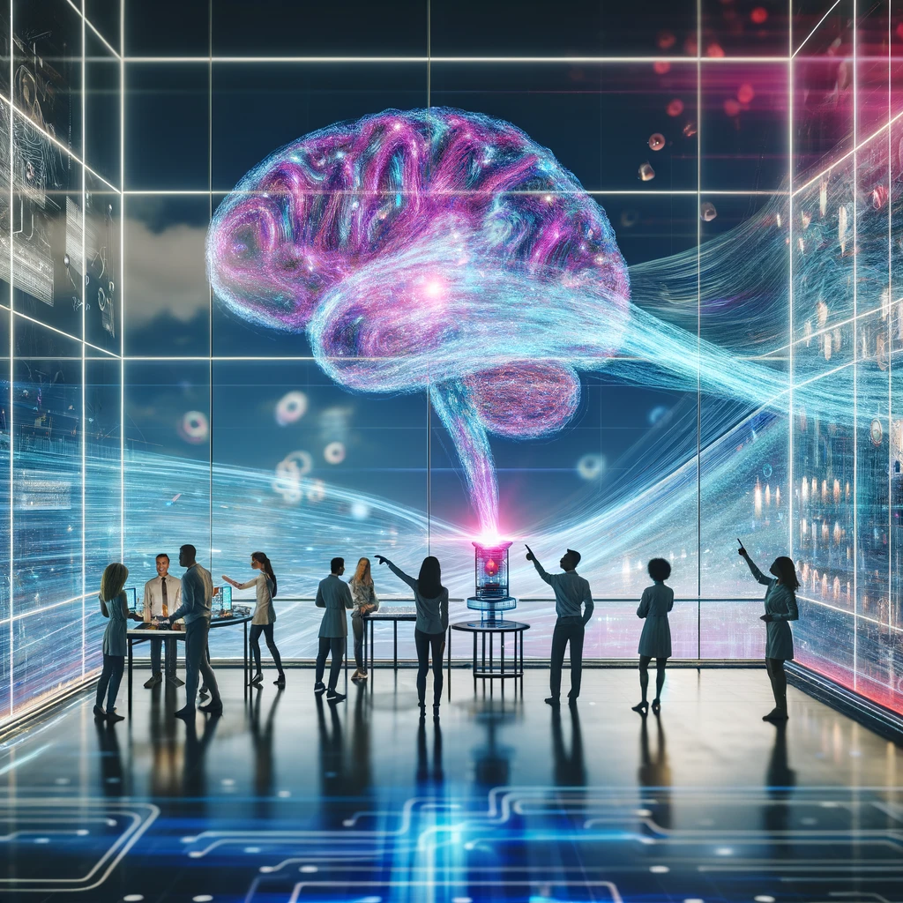

# Desvendando Realidades: O Poder das IAs Generativas no Mundo Moderno

## 📒 Descrição
Olá! Eu sou Nicolas Mello e estou explorando o empolgante mundo das IAs Generativas. Neste projeto, mergulhamos nas capacidades e desafios dessas tecnologias, que estão redefinindo os limites da criatividade e da produção de conteúdo. Inspirado pelo debate "Natty or Not" do fisiculturismo, que discute a autenticidade das conquistas físicas, questionamos o que é "natural" e "autêntico" na era da inteligência artificial.

## 🤖 Tecnologias Utilizadas
Utilizei várias ferramentas de IA generativa, incluindo:

1. GPT-4 para geração de textos e diálogos complexos.
2. DALL-E para criação de imagens detalhadas a partir de descrições textuais.
3. ElevenLabs para gerar as sínteses de fala usando inteligência artificial, permitindo converter texto em fala natural
Além disso, empreguei bibliotecas de código aberto como TensorFlow e PyTorch para ajustes e treinamentos personalizados de modelos.

## 🧐 Processo de Criação
O processo começou com a definição do objetivo e do escopo do projeto. Com as ferramentas selecionadas, realizei várias sessões experimentais, ajustando parâmetros e refinando os modelos para gerar conteúdos que fossem ao mesmo tempo inovadores e éticos. A interação entre diferentes tipos de IA permitiu uma criação multimodal, combinando texto, imagem e, em alguns casos, som.

## 🚀 Resultados
Os resultados foram surpreendentes. Consegui gerar arte digital que questiona a percepção de realidade, textos que desafiam os limites da autoria e imagens que flertam com o surreal. Cada criação serve como um ponto de discussão sobre o potencial e os limites das IAs generativas.

## 💭 Reflexão
Este projeto me fez refletir profundamente sobre o conceito de "natty" no contexto de IA. Em um mundo inundado de tecnologia, o que constitui a autenticidade? Além disso, enfrentei o desafio ético de garantir que as criações não fossem enganosas ou contribuíssem para a disseminação de informações falsas. A capacidade das IAs de colaborar na criação e propagação de fake news é uma preocupação real e um tema que exigiu uma vigilância constante durante o projeto.

## Tecnologias Utilizadas

[GPT-4 / DALL-E](https://chat.openai.com)

[ElevenLabs](https://elevenlabs.io)
